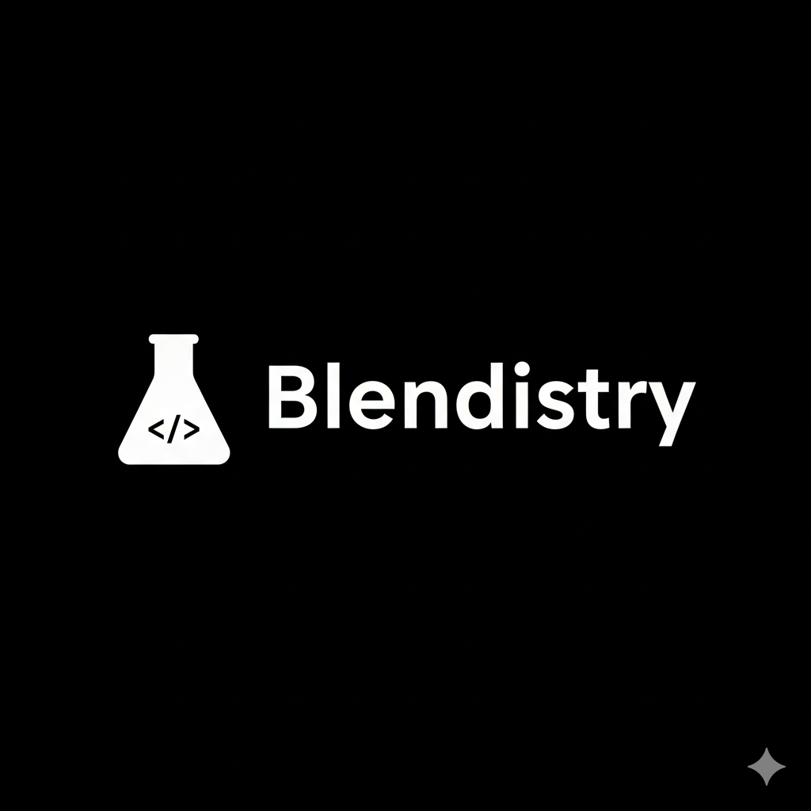
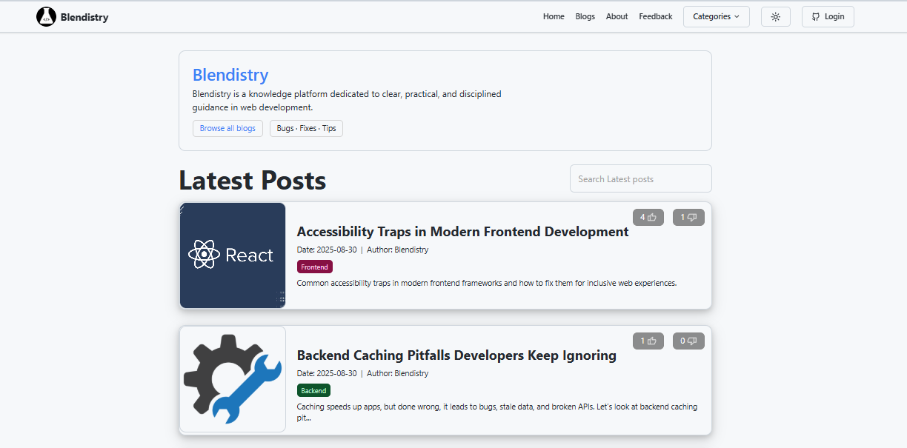
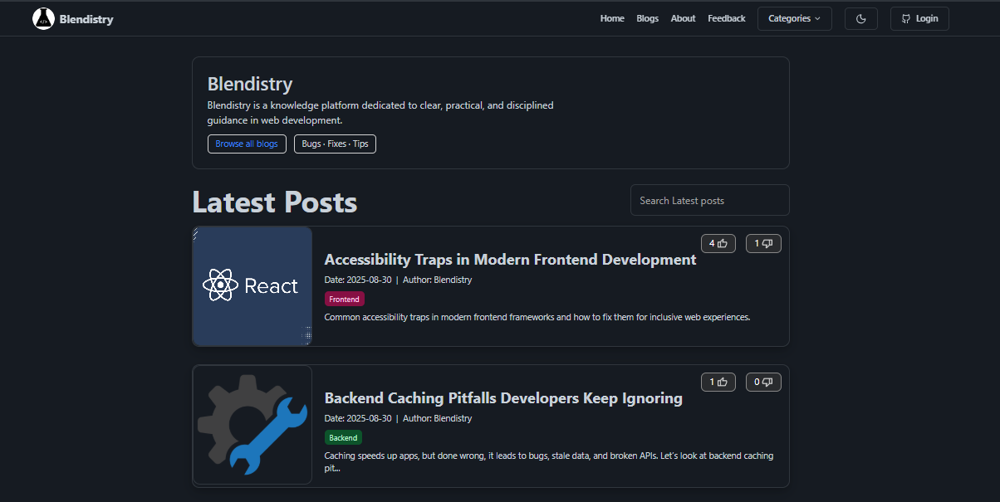
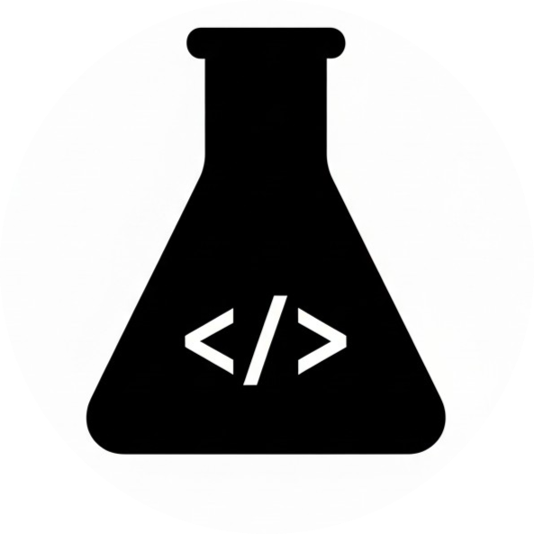

# Blendistry

Blendistry is a Knowledge blogging platform built with [Next.js](https://nextjs.org/) and [Supabase](https://supabase.com/) that provides a clean, minimal, and efficient way to share and manage technical content for developers.  

---

## Features

- User authentication with GitHub (via Supabase Auth)  
- Category-based blog organization  
- Responsive and modern UI with Tailwind CSS  
- Feedback system with GitHub login  
- Privacy Policy, Terms of Service, and settings pages included  
- SEO-friendly with dynamic routing for posts and categories  

---

## Tech Stack

- **Frontend**: Next.js, React, Tailwind CSS  
- **Backend**: Supabase (Auth, Database)  
- **Deployment**: Vercel  

---

## Previews

### Light Mode

### Dark Mode

---

## Logo

---

